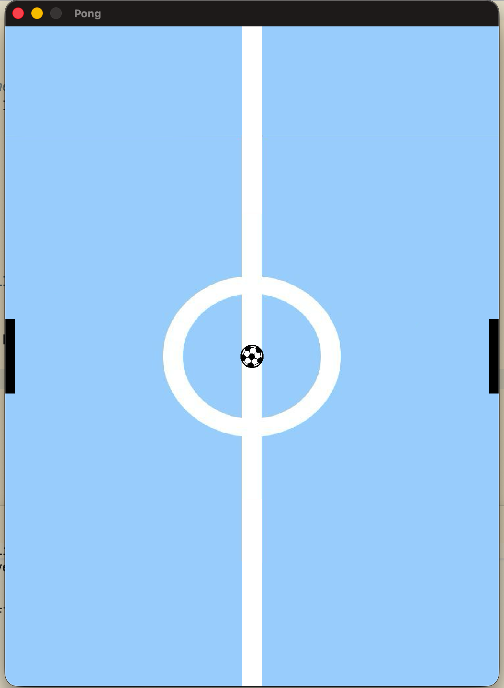

# Multiplayer Pong

A real-time multiplayer Pong game built from scratch in **C++17** with a custom UDP client-server architecture. Uses **Raylib** for rendering and **playit.gg** for hassle-free internet hosting — no port-forwarding required.



---

## Features

- **Custom UDP Networking** — Dedicated `server` and `client` executables communicate via raw UDP sockets for low-latency, real-time gameplay.
- **Cross-Platform** — Compiles and runs on both **macOS** and **Linux**. Pre-compiled static libraries are bundled in the repository so you don't need to install Raylib separately.
- **Hassle-Free Internet Play** — Integrates with [playit.gg](https://playit.gg/) to generate a public tunnel address, letting anyone connect globally without touching their router settings.

---

## Project Structure

```
.
├── include/        # Header files (networking, game logic, raylib.h)
├── lib/
│   ├── mac/        # macOS static library (libraylib.a)
│   └── linux/      # Linux static library (libraylib.a)
├── src/            # Source files (client.cpp, server.cpp, networking.cpp)
├── bin/            # Compiled executables (generated by make)
└── Makefile        # OS-detecting build script
```

---

## Prerequisites

You need a **C++17-compatible compiler** (`g++`) and `make`. The Raylib static library is already included, but Linux needs a few system graphics packages to link against.

**Linux (Ubuntu/Debian):**

```bash
sudo apt update
sudo apt install build-essential libx11-dev libxcursor-dev libxinerama-dev \
                 libxrandr-dev libxi-dev libgl1-mesa-dev libglu1-mesa-dev
```

**macOS:** No extra dependencies needed — Xcode Command Line Tools (`xcode-select --install`) is sufficient.

---

## Building

Clone the repository and compile both executables with a single command:

```bash
git clone https://github.com/AdhirajSB/your-repo-name.git
cd your-repo-name
make
```

Executables are output to `bin/`.

---

## Running the Game

### 1. Set up a public tunnel (host only)

To let friends connect over the internet without port-forwarding:

1. Download and run the [playit.gg](https://playit.gg/) agent on the host machine.
2. Create a custom tunnel pointing to `127.0.0.1:<your-server-port>`.
3. playit.gg will give you a public address and port (e.g. `sparkling-potato.auto.playit.gg:12345`).

### 2. Hardcode the address and port, then compile

Open `src/client.cpp` and set the connection details to the address and port provided by playit.gg.
The first argument in connectServer is the address and the second is the port.
```cpp
    if (client.connectServer("147.185.221.180", 13088) == false){
        return 1;
    }
```

Then compile:

```bash
make
```

Share the resulting `bin/client` binary with anyone who wants to join — the address is baked in, no manual input needed.

### 3. Start the server

On the host machine, run:

```bash
./bin/server
```

### 4. Connect as a client

On any machine (same network or internet), run:

```bash
./bin/client
```

---

## How It Works

The server maintains authoritative game state — ball position, velocities, and scores — and broadcasts updates to both clients over UDP. Each client sends its paddle input to the server, which applies it and rebroadcasts the new state. This keeps gameplay consistent regardless of which machine is hosting.

playit.gg acts as a relay, forwarding UDP traffic from its public endpoint to the server's local port, eliminating the need for NAT traversal or router configuration.
